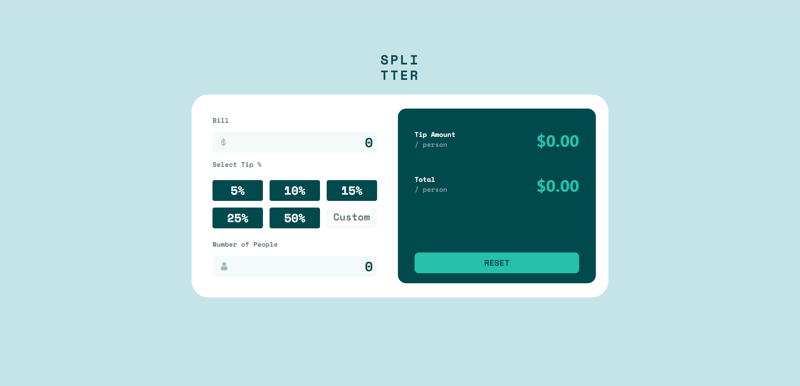
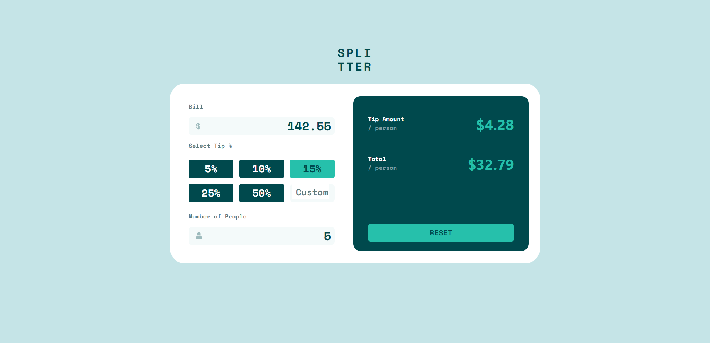
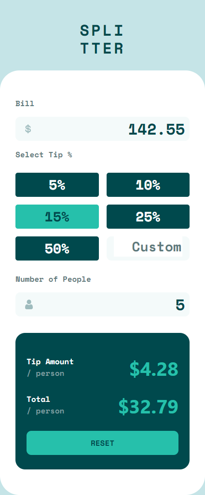
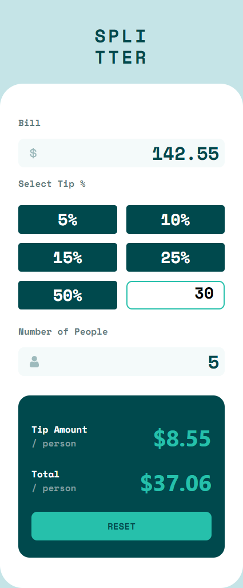

# Frontend Mentor - Tip calculator app solution

This is a solution to the [Tip calculator app challenge on Frontend Mentor](https://www.frontendmentor.io/challenges/tip-calculator-app-ugJNGbJUX). Frontend Mentor challenges help you improve your coding skills by building realistic projects.

## Table of contents

- [Overview](#overview)
    - [The challenge](#the-challenge)
    - [Screenshot](#screenshot)
    - [Links](#links)
- [My process](#my-process)
    - [Built with](#built-with)
    - [What I learned](#what-i-learned)
    - [Continued development](#continued-development)
- [Author](#author)

## Overview

### The challenge

Users should be able to:

- View the optimal layout for the app depending on their device's screen size
- See hover states for all interactive elements on the page
- Calculate the correct tip and total cost of the bill per person

### Screenshot

### Links

- Solution URL: [Add solution URL here](https://your-solution-url.com)
- Live Site URL: [Add live site URL here](https://your-live-site-url.com)

## My process

### Built with

- [React](https://reactjs.org/) - JS library
- CSS custom properties
- Flexbox
- Mobile-first workflow

### What I learned
It was a great opportunity to better understand React hooks, such as useState() and useEffect(). Also I once again trained mobile-first development of CSS layout.

### Continued development
I still want to figure out how to make warning span for zero persons input, which however wouldn't be shown at default state as long as according to design screenshots default state should be 0.

## Author

- Website - [Add your name here](https://www.your-site.com)
- Frontend Mentor - [@DaringuL](https://www.frontendmentor.io/profile/DaringuL)
- Twitter - [@Daringu_L](https://twitter.com/Daringu_L)

**Note: Delete this note and add/remove/edit lines above based on what links you'd like to share.**
